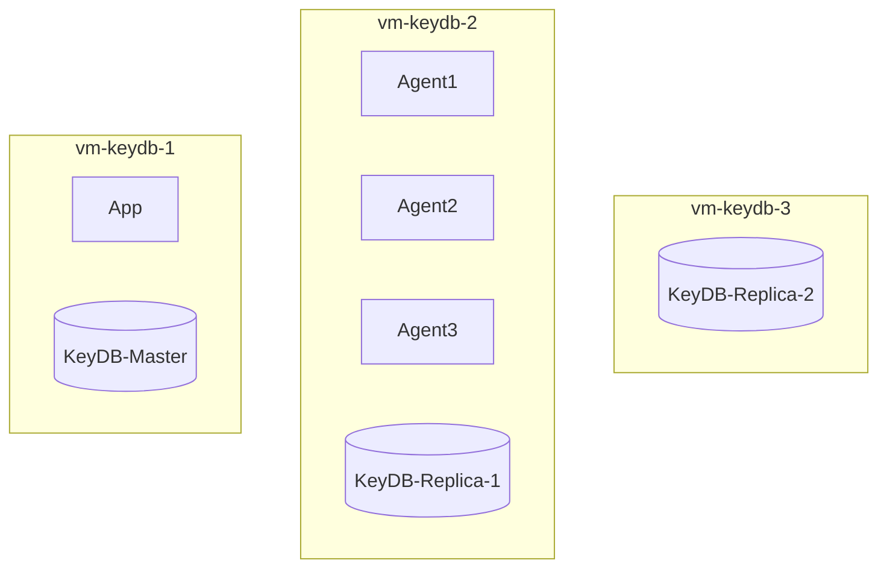
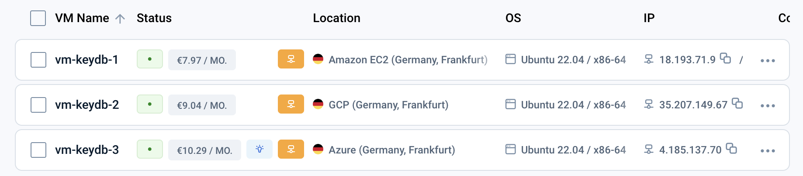

# KeyDB VM Multi-Cloud

The following is a showcase for the multi-cloud management capabilities of emma.ms

Use-Case: “As a devops engineer, I want so setup a three nodes KeyDB cluster in three different cloud providers in order to ensure cloud provider failover and ensure data is near client applications."

To showcase this we are using Keydb.dev a fully open source faster drop in alternative to Redis. And a small leaderscore python application running on the same VMs.

## Overview

In this showcase we are using three VMs: 

* 1: KeyDB Master and app
* 2: KeyDB Replica 1 and some agents
* 3: KeyDB Replica 2



## Prerequisites

* Emma account
* A SSH key installed (Company > Security)
* API Access (Project > Settings > Service Apps)

```sh
export CLIENT_ID=...
export CLIENT_SECRET=...
```

## Launch Three VMs manually

Start off by creating a security group to allow all inbound and outbound traffic. We will change this later. (Project > Security groups > + Add group). Type: All traffic, Source IP: 0.0.0.0/0.

Launch three new VMs:
 * Select Europe with Frankfurt & Darmstadt
 * Select AWS, Azure and GCP as Cloud Providers
 * Ensure Multi-Cloud Network is enabled
 * Select Ubuntu as the OS
 * Select your ssh key
 * Select your security group
 * Name the VMs `vm-keydb-1`, `vm-keydb-2`, `vm-keydb-3`




## Install and Configure KeyDB

Once ready grab the public IPs and login via SSH:
```sh
export IP1=...
export IP2=...
export IP3=...
# For AWS the user is 'ubuntu' for Azure/GCP the user is 'clouduser'
ssh ubuntu@$IP1 -i key.pem
ssh clouduser@$IP2 -i key.pem
ssh clouduser@$IP3 -i key.pem
```

On the machines install KeyDB following https://docs.keydb.dev/docs/ppa-deb:
```sh
# Install
echo "deb https://download.keydb.dev/open-source-dist $(lsb_release -sc) main" | sudo tee /etc/apt/sources.list.d/keydb.list
sudo wget -O /etc/apt/trusted.gpg.d/keydb.gpg https://download.keydb.dev/open-source-dist/keyring.gpg
sudo apt update
sudo apt install -y keydb
sudo systemctl enable keydb-server

# Configure server
# For the master and the replicas:
sudo service keydb-server stop
sudo vi /etc/keydb/keydb.conf
# - comment-out `bind 127.0.0.1 -::1` to listen on all interfaces
# - set `protected-mode no`

# Additionaly for the replication on IP2, IP3
# - set `replicaof <IP1> 6379`
sudo service keydb-server start
```

Test / troubleshoot KeyDB:
```sh
keydb-cli -h $IP1 -p 6379
SET my-super-cloud "emma"
GET my-super-cloud

sudo service keydb-server status
journalctl -xeu keydb-server.service
```

## Install showcase App

As a showcase we are using a simple leaderboard Python app leveraging [KeyDB sorted sets](https://docs.keydb.dev/docs/data-types-intro/#keydb-sorted-sets). You can find the code in [./keydb-example](./keydb-example).

Install and run the app on the first machine which connects to the local keydb:

```sh
cd keydb-example/
python3 -m venv venv
source venv/bin/activate
pip3 install -r requirements.txt
cd ..
```

```sh
# copy app to the host
scp -i key.pem -pr keydb-example/ ubuntu@$IP1:/home/ubuntu/
ssh ubuntu@$IP1 -i key.pem "sudo apt install python3-pip"
ssh ubuntu@$IP1 -i key.pem "cd keydb-example/; pip install -r requirements.txt"
# run the app
ssh ubuntu@$IP1 -i key.pem "export CLIENT_ID=$CLIENT_ID; export CLIENT_SECRET=$CLIENT_SECRET; python3 keydb-example/app.py"
```

Open http://$IP1:5000 in a browser.

Install and run 3 agents on the second host:
```sh
# copy agent to the host
scp -i key.pem keydb-example/agent.py clouduser@$IP2:/home/clouduser
# run agent
ssh clouduser@$IP2 -i key.pem "python3 agent.py $IP1 User-1"
ssh clouduser@$IP2 -i key.pem "python3 agent.py $IP1 User-2"
ssh clouduser@$IP2 -i key.pem "python3 agent.py $IP1 User-3"
```


## Backup

Here is a simple backup script for KeyDB

```sh
#!/bin/bash

# Directory to store the backups
BACKUP_DIR="/tmp/keydb_backups"
# Ensure the backup directory exists
mkdir -p $BACKUP_DIR

# The command to create the dump with a timestamp
TIMESTAMP=$(date +\%Y-\%m-\%d_\%H:\%M:\%S)
DUMP_FILE="$BACKUP_DIR/dump_$TIMESTAMP.rdb"
DUMP_CMD="keydb-cli --rdb $DUMP_FILE"

# Run the dump command
$DUMP_CMD

# Rotate the backups: keep only the last 6 versions
cd $BACKUP_DIR
ls -t dump_*.rdb | sed -e '1,6d' | xargs -d '\n' rm -f
```

## Securing the setup

### Security Groups

The first step to secure the setup is setting security groups. For the sake of simplicty of this show-case we are using one security group. In a production setup you would use more fingrained security groups.

Create a new policy with these inbound rules:
| description                          | protocol | ports | ip range       |
|--------------------------------------|----------|-------|----------------|
| SSH access                           | tcp      | 22    | 0.0.0.0/0      |
| emma management                      | all      | all   | 52.59.77.54/32 |
| keydb                                | tcp      | 6379  | 10.0.0.0/8     |

and attach the security group to the three VMs.

