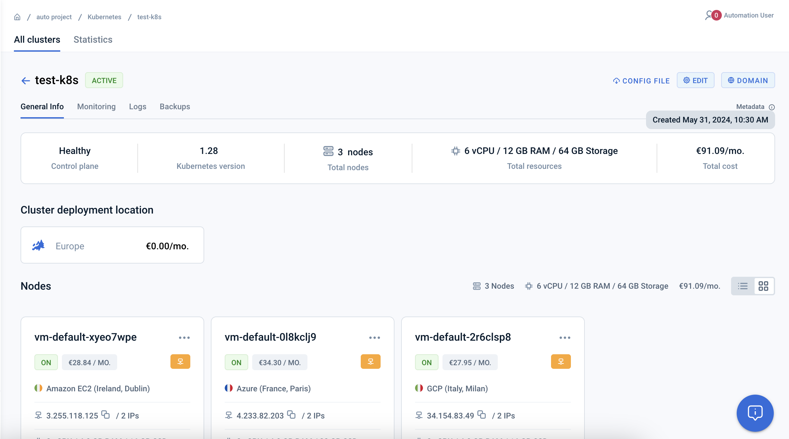

# KeyDB K8s Multi-Cloud

The following is a showcase for the multi-cloud management capabilities of emma.ms. This is a followup of [../01-multicloud-keydb-vm/](../01-multicloud-keydb-vm/) leveraging the capabilities of K8s.

## Prerequisites

* Emma account
* Kubernetes config (Project -> Kubernetes -> Cluster -> Config file)
* API Access (Project > Settings > Service Apps)
* Helm
* kubectl


## Launch Cluster with 3 worker nodes

Launch Kubernets Cluster:

 * Select Europe with Dublin, Paris, Milan
 * Select AWS, Azure and GCP as Cloud Providers
 * Select Ubuntu as the OS
 * Define names, if necessary




## Install and Configure KeyDB

Once got kubeconfig:

Let's install KeyDB with official helm chart.

```sh
export KUBECONFIG=/path/to/kubeconfig
helm repo add enapter https://enapter.github.io/charts/
helm upgrade -i --set persistentVolume.enabled=false  keydb enapter/keydb
```

```sh
kubectl get pods -o wide
NAME      READY   STATUS    RESTARTS   AGE     IP               NODE                  NOMINATED NODE   READINESS GATES
keydb-0   1/1     Running   0          7m7s    192.168.65.251   vm-default-5ywjf4ga   <none>           <none>
keydb-1   1/1     Running   0          6m36s   192.168.66.87    vm-default-cha52oy3   <none>           <none>
keydb-2   1/1     Running   0          6m6s    192.168.64.5     vm-default-t5r5f4xc   <none>           <none>
```

Test / troubleshoot KeyDB:

```sh
kubectl exec -it keydb-0 -- keydb-cli -h localhost -p 6379 SET my-super-cloud "emma"                                                                                                        
OK

kubectl exec -it keydb-1 -- keydb-cli -h localhost -p 6379 GET my-super-cloud                                                                                                               
"emma"

kubectl exec -it keydb-2 -- keydb-cli -h localhost -p 6379 GET my-super-cloud                                                                                                               
"emma"

```

## Install showcase app

As a showcase we are using a simple leaderboard Python app leveraging [KeyDB sorted sets](https://docs.keydb.dev/docs/data-types-intro/#keydb-sorted-sets). 

You can find the code in [../01-multicloud-keydb-vm/keydb-example](../01-multicloud-keydb-vm/keydb-example).
The code also packed in Docker and available at the public repo `public.ecr.aws/emma/multicloud-keydb-demo`

1. Modify [./keydb-example/multicloud-keydb/helm/multicloud-keydb/values.yaml](multicloud-keydb/helm/multicloud-keydb/values.yaml), 
set CLIENT_ID and CLIENT_SECRET in the `environment` section

2. Install and run the app in the cluster (with Helm):

```sh
cd helm/multicloud-keydb/
helm upgrade -i  multicloud-keydb .
Release "multicloud-keydb" has been upgraded. Happy Helming!
NAME: multicloud-keydb
LAST DEPLOYED: Fri May 31 14:10:55 2024
NAMESPACE: default
STATUS: deployed
REVISION: 2
NOTES:


> kubectl get pods
NAME                               READY   STATUS    RESTARTS   AGE
keydb-0                            1/1     Running   0          5h22m
keydb-1                            1/1     Running   0          5h22m
keydb-2                            1/1     Running   0          5h21m
multicloud-keydb-79c96c986-4xch9   1/1     Running   0          111m

```

3. Run agent with generator

One console:

```sh
kubectl port-forward deployment/multicloud-keydb  5000:5000                                                                                                                            
Forwarding from 127.0.0.1:5000 -> 5000
Forwarding from [::1]:5000 -> 5000
```

Second console:

```sh
# run agent
cd ../01-multicloud-keydb-vm/keydb-example/
source venv/bin/activate
python3 agent.py 127.0.0.1 User-1
```