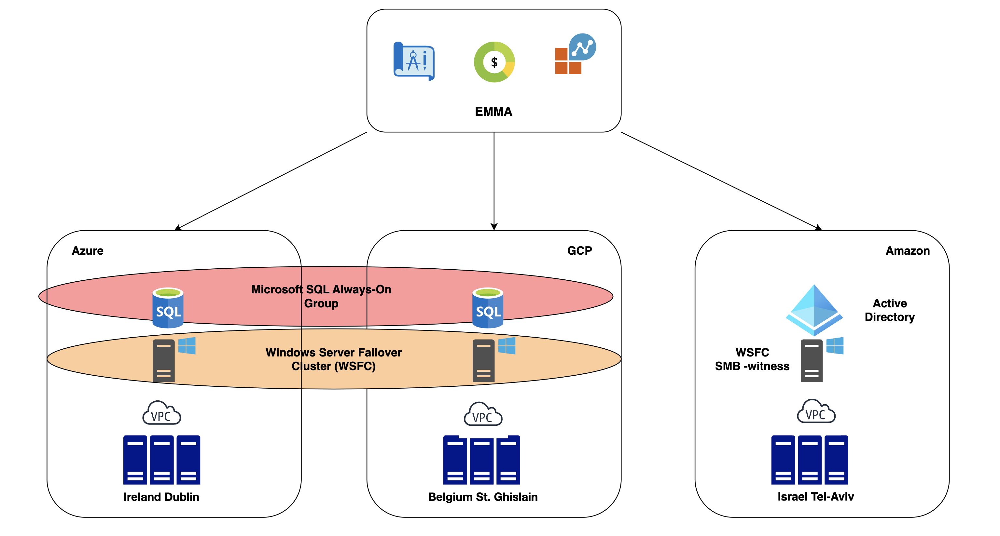

# Microsoft SQL High Availability Setup with Multi-Cloud Network by EMMA

The following is a showcase of the multi-cloud management capabilities of emma.ms

Use-Case: “In a large company, data plays a key role in the successful operation of all business processes. In such a situation, data loss or even a short period of server downtime can have catastrophic consequences. When using MS SQL, the task of ensuring disaster recovery is addressed through the Always-On Availability Group across different cloud providers. If one cloud provider encounters an issue, the data remains safe in other clouds. This approach allows minimizing risks and ensuring continuous data availability for client applications.

To mitigate data loss, as a DevOps engineer, I can set up a Microsoft SQL Server Always-On Availability Group across different cloud providers. This ensures that data is always protected, thereby ensuring disaster recovery and uninterrupted business processes regardless of unforeseen circumstances."

In this setup, we use Microsoft SQL Server and demonstrate how to maintain high availability and disaster recovery across Azure, GCP, and AWS using the EMMA platform.

## Overview
In this showcase, we use three VMs:

1. Primary SQL Server (Azure)
2. Secondary SQL Server (GCP)
3. Domain controller and Witness Server (AWS)




### Prerequisites
Emma Account

## Launch Three VMs Manually

### 1. Launch Three New VMs

* Cloud Providers: Choose AWS, Azure, and GCP.
* Location:
  
   Azure - Oslo, Norway
  
   Amazon - Tel Aviv-Yafo, Israel
  
   Google - St. Ghislain, Belgium
  
* Ensure Multi-Cloud Network is enabled.
* Operating System: Select Windows Server version 2022.
* Security Group: Apply your security group.
* VM Names: vm-sql-1 (Azure), vm-sql-2 (GCP), vm-dc (AWS).

### 2. Change a Security Group Rules
Because we have trusted internal network (between cloud vpc) we need to allow all inbound traffic from 10/8 network or allow traffic from all our vpc subnets in different clouds (given the dynamic nature of cloud providers, it can be challenging) and outbound traffic initially. Also we need to allow Remote desktop protocol from internet for simplicity to manage our virtual machines.

## Create Microsoft Domain and Join VMs
 1. Rename VM where we plan to setup Domain controller
 2. Setup domain controller
 3. Join VMs into domain

## Install and Configure SQL Server

### Step 1: Obtain Public IPs and Login via RDP:

You can check Public IP addresses with EMMA portal on information panel of each VM.

### Step 2: Install SQL Server:

On each VM, install SQL Server following the official [Microsoft documentation](https://learn.microsoft.com/en-us/sql/database-engine/install-windows/install-sql-server?view=sql-server-ver15):


```sh
# Download the SQL Server installer from the official site
Invoke-WebRequest -Uri "https://go.microsoft.com/fwlink/?linkid=866658" -OutFile "SQLServer2019-SSEI-Expr.exe"
# Run the installer
Start-Process -FilePath ".\SQLServer2019-SSEI-Expr.exe" -ArgumentList "/qs", "/ACTION=Install", "/FEATURES=SQLENGINE", "/INSTANCENAME=MSSQLSERVER", "/SQLSVCACCOUNT='NT AUTHORITY\System'", "/SQLSYSADMINACCOUNTS='BUILTIN\Administrators'", "/AGTSVCSTARTUPTYPE=Automatic" -NoNewWindow -Wait
```

### Step 3: Configure Always-On Availability Groups:
On the primary server (Azure VM):

```sh
# Enable AlwaysOn Availability Groups
Set-ItemProperty -Path "HKLM:\SOFTWARE\Microsoft\Microsoft SQL Server\MSSQL15.MSSQLSERVER\MSSQLServer" -Name "SQLAlwaysOn" -Value 1
# Restart SQL Server
Restart-Service -Name "MSSQLSERVER"
Set up the Always-On Availability Group, including creating the necessary endpoints, availability group, and adding replicas (follow detailed steps in the official guide).
```

## Test the Setup

### Step 1: Verify SQL Server Status:

```sh
Get-Service -Name "MSSQLSERVER"
```
### Step 2: Test Always-On Availability Group:

Use SQL Server Management Studio (SSMS) or sqlcmd to connect to the primary server and verify the status of the availability group and replicas.

### Step 3: Simulate Failover:

Trigger a manual failover to ensure that the secondary server (GCP) can take over in case of failure.

## Install and Configure Witness Server

## Step 1: Configure Quorum:

On the witness server (AWS VM), configure the file share or cloud witness to maintain quorum in the cluster.

## Step 2: Verify Quorum Configuration:

Ensure that the cluster has the correct quorum configuration by using the Failover Cluster Manager or PowerShell cmdlets.Summary
